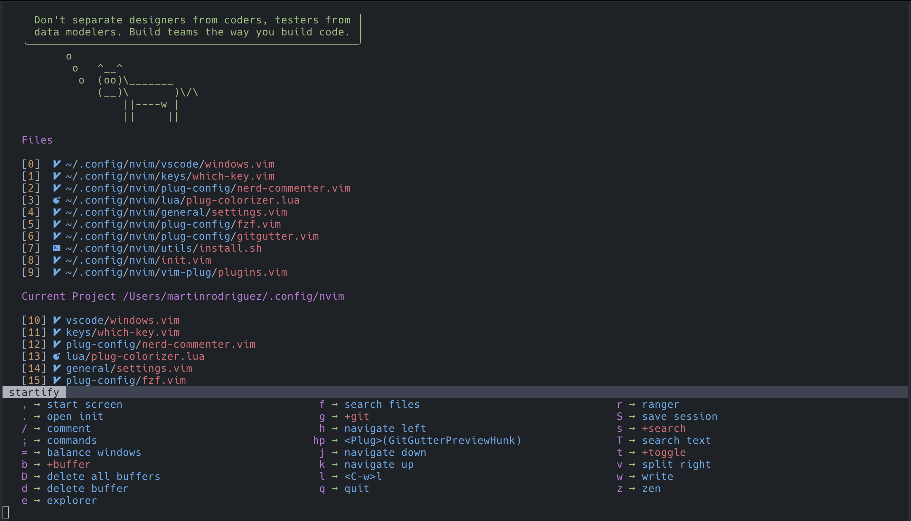

# Nvim Config



This is a fork of https://github.com/ChristianChiarulli/nvim
All credits to him

## Install in one command

The following will install this config if you have an existing config it will move it to `~/.config/nvim.old`

This script only supports Mac, Ubuntu and Arch

```
bash <(curl -s https://raw.githubusercontent.com/rodriguezmarting/nvim/master/utils/install.sh)
```

## Install Neovim

- On Mac

  ```
  brew install neovim
  ```

- Ubuntu

  ```
  sudo apt install neovim
  ```

- Arch

  ```
  sudo pacman -S neovim
  ```

## Clone this repo into your config

```
git clone https://github.com/rodriguezmarting/nvim.git ~/.config/nvim
```

## Install python & node support

```
pip install pynvim
```

```
npm i -g neovim
```

## Install clipboard support

- On mac pbcopy should be builtin

- On Ubuntu

  ```
  sudo apt install xsel
  ```

- On Arch Linux

  ```
  sudo pacman -S xsel
  ```

## List of programs you should install

- ranger
- ueberzug
- ripgrep
- silver_searcher
- fd
- universal-ctags

## Language Servers

Since CoC doesn't support all languages in there extensions
I recommend installing some language servers from scratch
and adding them to your `coc-settings.json` file

Example:

- bash

  `npm i -g bash-language-server`

  ```
  "languageserver": {
  "bash": {
    "command": "bash-language-server",
    "args": ["start"],
    "filetypes": ["sh"],
    "ignoredRootPaths": ["~"]
    }
  }
  ```
  
## Added features

- Git bindings with leader + g, inspired on magit (Emacs)
- Navigation between splits inside which key
- Increased time window for the keystrokes
- Vim surround installed and configured
- Vim commentary installed and configured
- Removed all remote configurations
- Flutter language server added
- Clojure tools added
